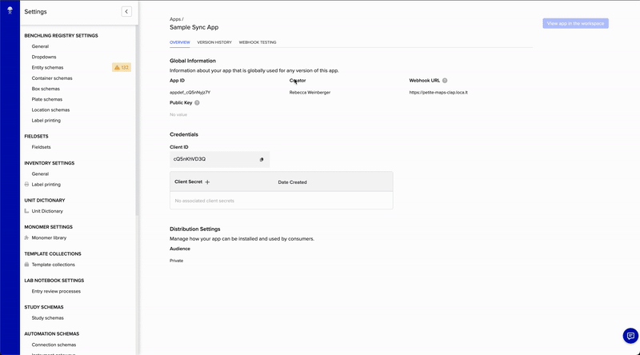
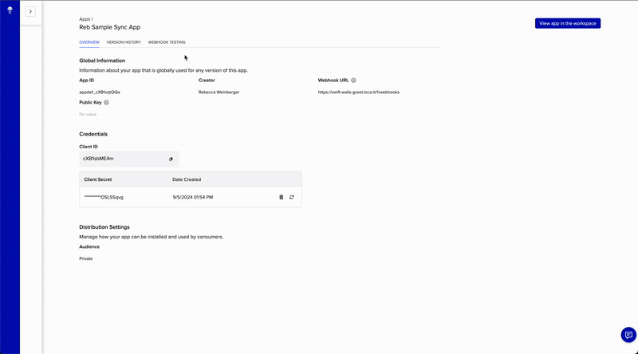

# App Workshop - Building Live

## Prerequisites

Please come with the following pre-installed and configured on your machine:

1. [Docker Desktop](https://www.docker.com/products/docker-desktop/)
    1. Example test: `docker run --rm -it python:3.11 bash`
1. [Git](https://github.com/git-guides/install-git)
    1. Example test: `git clone git@github.com:benchling/app-examples-python.git`
1. A Python IDE
    1. For the workshop, **we recommend [VSCode](https://code.visualstudio.com/Download) with the [Dev Containers](https://marketplace.visualstudio.com/items?itemName=ms-vscode-remote.remote-containers) plugin installed if you don’t have an IDE preference**
    1. [PyCharm](https://www.jetbrains.com/pycharm/download/) users may have success with its [partial support for Dev Containers](https://www.jetbrains.com/help/pycharm/connect-to-devcontainer.html#create_dev_container_inside_ide)
    1. If you’d like to bring your own IDE, we ask that you come prepared to:
        1. Setup your own Python virtual environment for **Python 3.11** 
        1. Install requirements on your own (e.g., `pip install -r requirements.txt`)
1. Ensure that you have no other processes already running on **port 8000**.

### Notes on Docker for Windows

- Some Windows machines may require extra configuration when running Docker. If you’re not able to run `docker-compose up –build` successfully on the example Git repository, you may need to configure Docker to “Use ContainerD for pulling and storing images" in `Docker > Settings > Features in development > Beta Features`.
- If you encounter an error running any Docker commands that looks like `ERROR: request returned Bad Gateway for API route and version`, following these instructions may help: https://github.com/docker/for-mac/issues/6956#issuecomment-1876444658

## Environment setup

1. Clone the repository: `git clone git@github.com:benchling/app-examples-python.git`
    1. If you don't have git setup with SSH, you may receive an error. You can clone via HTTPS instead: `git clone https://github.com/benchling/app-examples-python.git`
1. Checkout the workshop branch: `git checkout benchtalk-workshop`
    1. Pull the latest if you previously checked out: `git pull`
1. Navigate to the example directory for **chem-sync-local-flask**:
    1. `cd app-examples-python/examples/chem-sync-local-flask/`
1. Create a `.client_secret` placeholder file required by Docker
    1. *nix: `touch .client_secret`
    1. Windows: `echo.> .client_secret`
1. Start building the Docker containers
`docker compose up --build -d`
1. Optionally start the Docker logs `docker compose logs -f` in a separate terminal window

## IDE setup

In **VSCode**:
1. `File > Open Folder > app-examples-python/examples/chem-sync-local-flask/`
    1. It's important to open the `chem-sync-local-flask` folder, _not_ the root `app-examples-python` folder
1. Click **Reopen in Container** when prompted (you can also do this from the lower left corner menu)
1. You may need to click **Reload Window** to finish loading extensions. This is normal.

In PyCharm:
1. `File > Open > app-examples-python/examples/chem-sync-local-flask/`
1. Open the file `.devcontainer/devcontainer.json`
1. In the left tray, click the container icon and select **Create Dev Container and Mount Sources**
1. Accept the defaults, click **Build Container and Continue**

Any other IDE:
1. In `app-examples-python/examples/chem-sync-local-flask/`
1. Create a **Python 3.11** virtual environment, activate it, and install requirements (e.g., `pip install -r requirements.txt`)

### Check Existing Docker Setup
1. Once Docker has finished building and composing up:
`curl localhost:8000/health`


## Discuss App Layout
1. Observe the `benchling-sdk` dependency in `requirements.txt`

## Setting up the App in Benchling

1. Navigate to https://dev-training.benchling.com/ and login
1. Open `manifest.yaml` and rename the App's `name` attribute under `info` by suffixing your name to the end
    1. Example: `Sample Sync App` -> `Sample Sync App FirstName LastName`

### Upload the App Manifest

Click the user icon in the bottom left corner to bring up the main menu. Select "Feature Settings" > "Developer Console"

Next, click the "Create app" button and choose "From manifest."

When prompted to upload a file, select `manifest.yaml` and click "Create."


### Update the Webhook URL

Every time we restart the `local-tunnel` Docker container, it will provision
a new public webhook URL. We can check logs with `docker compose logs local-tunnel` to retrieve it:

```
app-workshop-local-tunnel-1   | your url is: https://brave-wombats-poke.loca.lt
```

On *nix systems, you can easily obtain _just_ the URL via:

```
docker compose logs local-tunnel | grep -o https://.* | tail -n 1
```

Example Output:

```
https://brave-wombats-poke.loca.lt
```

> 💡 Don't forget to append `/1/webhooks`, making the full URL given to Benchling `https://brave-wombats-poke.loca.lt/1/webhooks`

Update the Benchling App's Webhook URL in the UI with the new server and
append the path our Flask route expects (see `local_app/app.py`).

For example, if our `localtunnel` generated URL is `https://brave-wombats-poke.loca.lt`,
the webhook URL in Benchling should be:

```
https://brave-wombats-poke.loca.lt/1/webhooks
```


### Generate a Client Secret

Generate a client secret in Benchling and be sure to copy the secret.


Since the client secret is sensitive, it's handled a bit differently. It's
registered as a `secret` in our `docker-compose.yaml` file, which will be looking
for a file `./client_secret`.

We can create this file and paste in the secret plaintext value if we have the secret in our clipboard.
On *nix:

```bash
touch .client_secret
pbpaste > .client_secret
```

> ⚠️ **Security Note:** Be sure to avoid committing `.client_secret` to a source code repository.

You'll then need to restart _just_ the `benchling-app` Docker service to pick up the changes:

```bash
docker-compose up -d
```

If you restart both containers, be sure to update your App in Benchling with the new webhook URL from localtunnel.

### Set the Client ID

Our App needs a Client ID to pair with the Client Secret for authentication to Benchling. In this case, we've created our 
App to accept `CLIENT_ID` as an environment variable.

One easy way to set an environment variables for Docker is to add a `.env` file.

```bash
touch .env
```

Windows example:

```cmd
echo.> .env
```

Open it in an editor of your choice and set the values with the plaintext client ID 
for your App. For example:

```
CLIENT_ID=42a0cd39-0543-4dd2-af02-a866c97f0c4d
```

```
docker-compose up -d
```

If you restart both containers, be sure to update your App in Benchling with the new webhook URL from localtunnel.

> ⚠️ **Security Note:** In production, store the secret with a secure solution such as a secrets store (AWS Secrets Manager, as an example) or, if storing programmatically, encrypted using app-layer encryption. Avoid placing it in plaintext anywhere in code or configuration.

### Set the App Definition ID

The App definition ID is available from the app's overview tab in the Developer Console.


Add it to your `.env` file with a variable name `APP_DEFINITION_ID`. The contents of your `.env` file should now look something like:

```
CLIENT_ID=Ts7jtwPohM
APP_DEFINITION_ID=appdef_Trow4zbR3o
```

### Install the App on the tenant

In order to use our new app on the tenant, we'll first have to install it. Navigate to the `Version History` tab on the developer console, and click `Install` on our app version (there should only be a single version for now).



### Create Benchling Dependencies for the App

If you examine the `configuration` section of `manifest.yaml`, you'll see our App
expects a few configuration items:
1. A folder
2. A molecule entity schema with two decimal fields

The `features` section of `manifest.yaml` also states that our App will render
its UI on an `ASSAY_RUN`. So we'll also need:
1. A Lab Automation run schema

#### Folder

Create a new folder where the molecules created by the App will be placed.
An existing folder can also be used, if the App has permissions to it.


#### Molecule Entity Schema

For this workshop, we've already created a sample entity schema that all participants can use, `Molecule Schema for Syncing`. No new entity schema will need to be created.

#### Lab Automation Run Schema

Because Assay Run objects will host the Canvas UI created by the App, each workshop participant will need to create their own unique lab automation run schema to pair with their app. The schema need not have any fields.


### Update the App's Configuration

App Configuration gives us a stable code contract for referencing data mapped in a Benchling tenant.
The values of the data in Benchling can then be changed without updating App code.

Now that we've created the necessary Benchling objects in previous steps, let's update our configuration to:
1. Specify the folder for syncing sequences
2. Link the `Molecule Schema for Syncing` entity schema and fields for the synced chemicals
3. Select our new assay run schema to associate with our Benchling App

### Permission the App

By default, Benchling Apps do not have permission to any data in Benchling.

In the workshop, your presenter will show this live. We will have an admin authorize your App on your behalf.

## Receiving our First Webhook

Let's test our app's ability to receive webhooks! To do this, we can use the `Webhook Testing` tab in the Developer Console. On this page, we can select any available webhook type to test out and send to our app's webhook URL - try it out! In general, this page is a great way to quickly imitate Benchling sending any type of webhook to your app in development.



Observe our debug logging printing webhooks that our app receives. (If you don't have the logs running already, you can run `docker compose logs -f`.)

For now, from observing the code, our app will simply return a `200 OK` response without doing any work. Over the course of this workshop, we'll build up our app to execute more complex logic in response to webhooks, in order to provide an interactive canvas-based UX for our end users.


## Rebuild the App!
1. Start in `local_app/app.py`

## Appendix A: Useful Workshop Commands

### Toggle Commented Code Blocks

VSCode and PyCharm:
* *nix: `Command + /`
* Windows: `Ctrl + /`

### Docker Commands

#### Tail Logs

```
docker compose logs -f
```

#### Restart individual service (e.g., local-tunnel)

```
docker compose restart local-tunnel
```

#### Check Running Services

```
docker compose ps
```